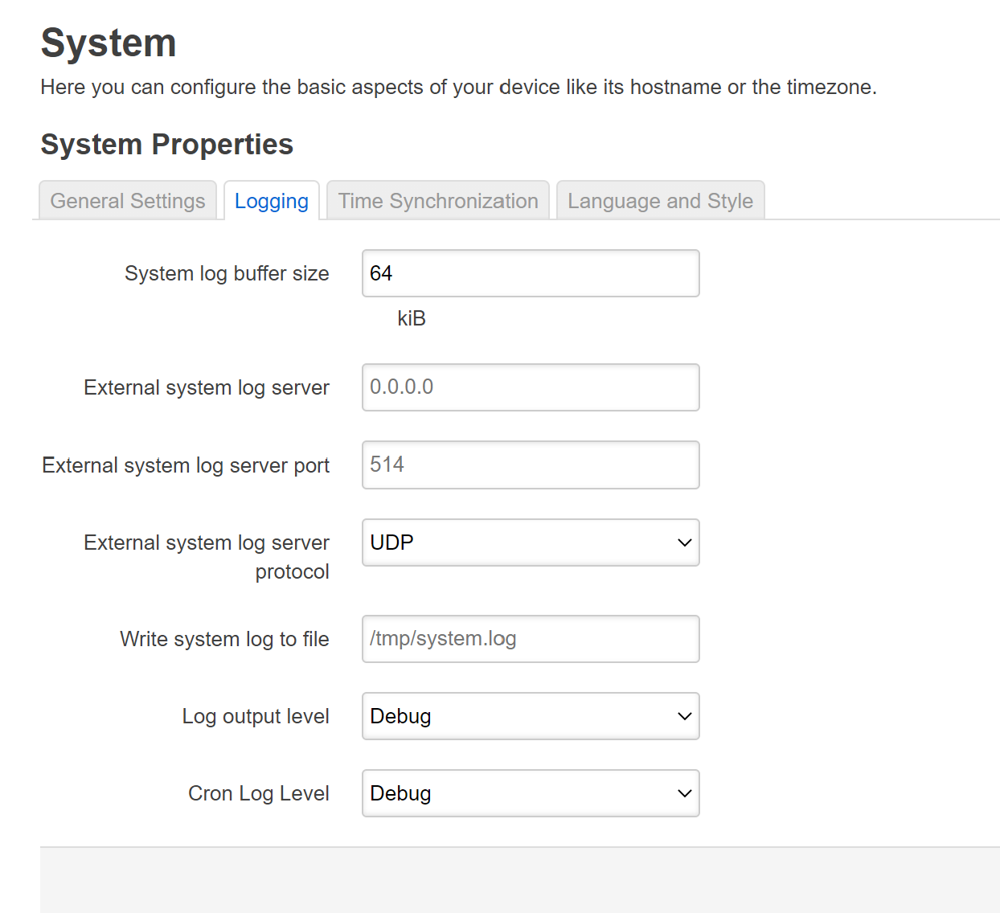
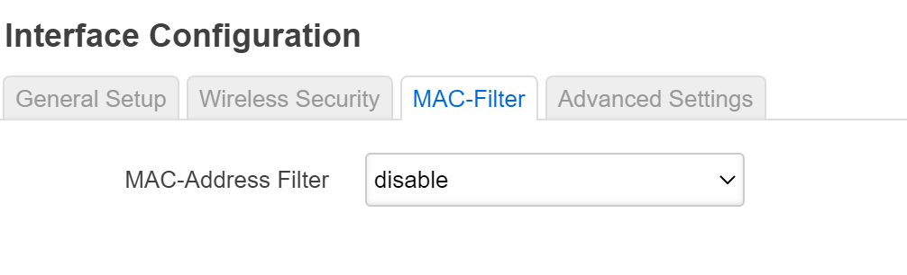
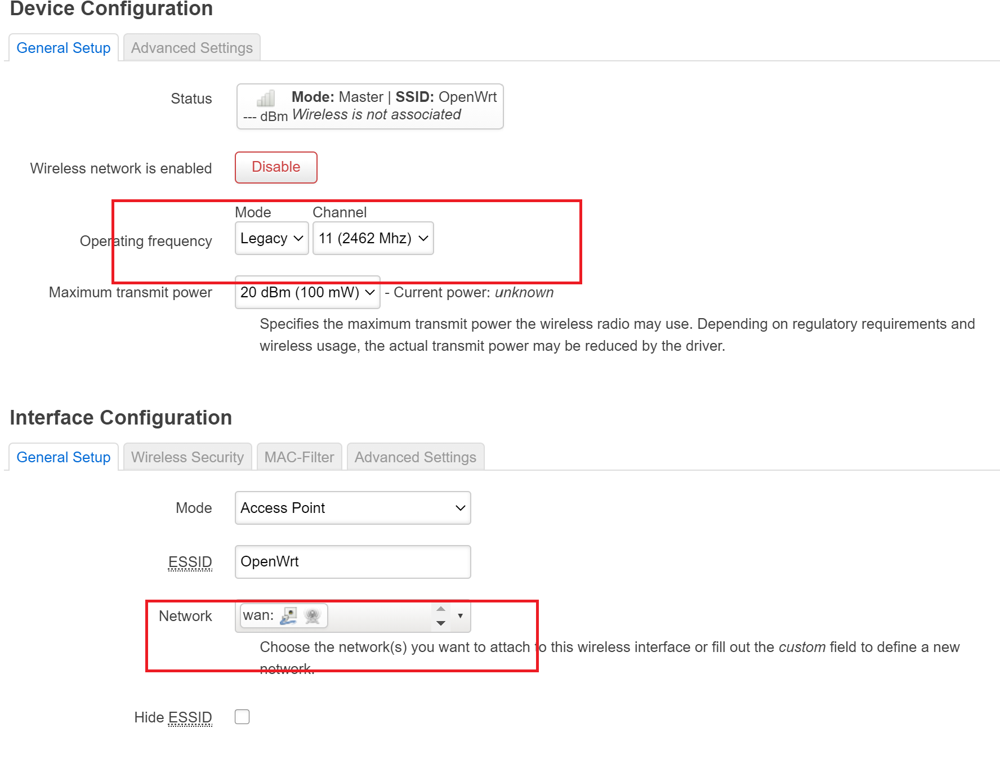

## OpenWrt 虚拟机搭建   

### 实验目的  
* 熟悉基于 OpenWrt 的无线接入点（AP）配置
* 为第二章、第三章和第四章实验准备好「无线软 AP」环境  

### 实验环境
* 可以开启监听模式、AP 模式和数据帧注入功能的 USB 无线网卡
* Virtualbox  

### 实验要求  
* 对照 第一章 实验 无线路由器/无线接入点（AP）配置 列的功能清单，找到在 OpenWrt 中的配置界面并截图证明；
* 记录环境搭建步骤；
* 如果 USB 无线网卡能在 OpenWrt 中正常工作，则截图证明；
* 如果 USB 无线网卡不能在 OpenWrt 中正常工作，截图并分析可能的故障原因并给出可能的解决方法。  

#### 各个配置界面  
* 重置和恢复AP到出厂默认设置状态  

* 设置AP的管理员用户名和密码  

* 设置SSID广播和非广播模式  

* 配置不同的加密方式  

* 设置AP管理密码  

* 配置无线路由器使用自定义的DNS解析服务器  

* 配置DHCP和禁用DHCP  

* 开启路由器/AP的日志记录功能（对指定事件记录）  

* 配置AP隔离(WLAN划分)功能  

* 设置MAC地址过滤规则（ACL地址过滤器） 

* 查看WPS功能的支持情况  
* 查看AP/无线路由器支持哪些工作模式  
  

### 环境搭建  
* 根据脚本安装OpenWrt虚拟机  
    ```  
    #!/usr/bin/env bash

    VER="19.07.5" # openwrt version
    VDI_BASE="openwrt1-x86-64-combined-squashfs.vdi"   

    #检查文件校验值，并将结果重定向到/dev/null  
    # -c 根据已生成的校验值对文件进行校验
    shasum -c img.sha256.sum -q >/dev/null 2>&1  

    #如果校验结果不一致，返回值为0表示一致，1是不一致
    if [[ $? -ne 0 ]];then  

    # 下载固件 
    wget https://downloads.openwrt.org/releases/19.07.5/targets/x86/64/openwrt-19.07.5-x86-64-combined-squashfs.img.gz
    #wget https://downloads.openwrt.org/releases/$VER/targets/x86/64/openwrt-$VER-x86-64-combined-squashfs.img.gz -O openwrt-x86-64-combined-squashfs.img.gz  

    # 解压缩
    gunzip openwrt-x86-64-combined-squashfs.img.gz
    fi

    shasum -c vdi.sha256.sum -q >/dev/null 2>&1
    if [[ $? -ne 0 ]];then
    # img 格式转换为 Virtualbox 虚拟硬盘格式 vdi
    VBoxManage convertfromraw --format VDI openwrt-x86-64-combined-squashfs.img "$VDI_BASE" 2>/dev/null
    # 新建虚拟机选择「类型」 Linux / 「版本」Linux 2.6 / 3.x / 4.x (64-bit)，填写有意义的虚拟机「名称」
    # 内存设置为 256 MB
    # 使用已有的虚拟硬盘文件 - 「注册」新虚拟硬盘文件选择刚才转换生成的 .vdi 文件

    #如果上条命令执行不成功，就把镜像拷贝到一个新文件  
    #dd  用指定大小的块拷贝文件  
    #if  输入文件名  
    #of  输出文件名
    if [[ $? -eq 1 ]];then
        # ref: https://openwrt.org/docs/guide-user/virtualization/virtualbox-vm#convert_openwrtimg_to_vbox_drive
        dd if=openwrt-x86-64-combined-squashfs.img of=openwrt-x86-64-combined-squashfs-padded.img bs=128000 conv=sync
        VBoxManage convertfromraw --format VDI openwrt-x86-64-combined-squashfs-padded.img "$VDI_BASE"
    fi
    fi

    # 创建虚拟机
    VM="openwrt-$VER"
    # VBoxManage list ostypes
    if [[ $(VBoxManage list vms | cut -d ' ' -f 1 | grep -w "\"$VM\"" -c) -eq 0 ]];then  
    echo "vm $VM not exsits, create it ..."  

    #创建一个名字为openwrt-19.07.5,操作系统类型为linux26_64的虚拟机
    VBoxManage createvm --name $VM --ostype "Linux26_64" --register  
    
    # 创建一个 SATA 控制器
    VBoxManage storagectl "$VM" --name "SATA" --add sata --controller IntelAHCI
    # 向该控制器安装一个「硬盘」
    ## --medium 指定本地的一个「多重加载」虚拟硬盘文件
    VBoxManage storageattach "$VM" --storagectl "SATA" --port 0 \
        --device 0 --type hdd --medium "$VDI_BASE"

    VBoxManage storagectl "$VM" --name "SATA" --remove

    # 将目标 vdi 修改为「多重加载」
    VBoxManage modifymedium disk --type multiattach "$VDI_BASE"
    # 虚拟磁盘扩容
    VBoxManage modifymedium disk --resize 10240 "$VDI_BASE"

    VBoxManage storagectl "$VM" --name "SATA" --add sata --controller IntelAHCI
    VBoxManage storageattach "$VM" --storagectl "SATA" --port 0 \
        --device 0 --type hdd --medium "$VDI_BASE"

    # 启用 USB 3.0 接口
    VBoxManage modifyvm "$VM" --usbxhci on
    # 修改虚拟机配置
    ## --memory 内存设置为 256MB
    ## --vram   显存设置为 16MB
    VBoxManage modifyvm "$VM" --memory 256 --vram 16

    # ref: https://docs.oracle.com/en/virtualization/virtualbox/6.1/user/settings-display.html
    # VMSVGA: Use this graphics controller to emulate a VMware SVGA graphics device. This is the default graphics controller for Linux guests.
    VBoxManage modifyvm "$VM" --graphicscontroller vmsvga

    # CAUTION: 虚拟机的 WAN 网卡对应的虚拟网络类型必须设置为 NAT 而不能使用 NatNetwork ，无线客户端连入无线网络后才可以正常上网
    ## 检查 NATNetwork 网络是否存在
    # natnetwork_name="NatNetwork"
    # natnetwork_count=$(VBoxManage natnetwork list | grep -c "$natnetwork_name")
    # if [[ $natnetwork_count -eq 0 ]];then
    #   VBoxManage natnetwork add --netname "$natnetwork_name" --network "10.0.2.0/24" --enable --dhcp on
    # fi

    ## 添加 Host-Only 网卡为第 1 块虚拟网卡
    ## --hostonlyadapter1 第 1 块网卡的界面名称为 vboxnet0
    ## --nictype1 第 1 块网卡的控制芯片为 Intel PRO/1000 MT 桌面 (82540EM)
    ## --nic2 nat 第 2 块网卡配置为 NAT 模式
    VBoxManage modifyvm "$VM" --nic1 "hostonly" --nictype1 "82540EM" --hostonlyadapter1 "vboxnet0"
    VBoxManage modifyvm "$VM" --nic2 nat 
    fi
    ```    
  
* 可用网络地址配置
修改 OpenWrt 局域网地址为当前 Host-only 网段内可用地址  ```vim /etc/config/network```  
可用地址参照  
  
修改完成后重启网络，使配置生效 
    ```/etc/init.d/network restart```  

    OpenWrt目前的网络配置  
  
* luci软件包的安装  
```  
# 更新 opkg 本地缓存
opkg update

# 检索指定软件包
opkg find luci
# luci - git-19.223.33685-f929298-1

# 查看 luci 依赖的软件包有哪些 
opkg depends luci
# luci depends on:
# 	libc
# 	uhttpd
# 	uhttpd-mod-ubus
# 	luci-mod-admin-full
# 	luci-theme-bootstrap
# 	luci-app-firewall
# 	luci-proto-ppp
# 	libiwinfo-lua
# 	luci-proto-ipv6

# 查看系统中已安装软件包
opkg list-installed

# 安装 luci
opkg install luci

# 查看 luci-mod-admin-full 在系统上释放的文件有哪些
opkg files luci-mod-admin-full
# Package luci-mod-admin-full (git-16.018.33482-3201903-1) is installed on root and has the following files:
# /usr/lib/lua/luci/view/admin_network/wifi_status.htm
# /usr/lib/lua/luci/view/admin_system/packages.htm
# /usr/lib/lua/luci/model/cbi/admin_status/processes.lua
# /www/luci-static/resources/wireless.svg
# /usr/lib/lua/luci/model/cbi/admin_system/system.
# ...
# /usr/lib/lua/luci/view/admin_network/iface_status.htm
# /usr/lib/lua/luci/view/admin_uci/revert.htm
# /usr/lib/lua/luci/model/cbi/admin_network/proto_ahcp.lua
# /usr/lib/lua/luci/view/admin_uci/changelog.htm  
```  
  

安装完成后，通过浏览器访问OpenWrt管理界面  
  

* 开启AP功能  
    ```  
    # 每次重启 OpenWRT 之后，安装软件包或使用搜索命令之前均需要执行一次 opkg update
    opkg update && opkg install usbutils  
    ```  
    通过```lsusb -t```查看无线网卡驱动是否安装好，发现driver后为空    

    通过 opkg find 命令可以快速查找可能包含指定芯片名称的驱动程序包，如下所示：
    ```
    opkg find kmod-* | grep 2870 
    ```
    安装 kmod-rt2800-usb 驱动之后，再执行 lsusb -t 时发现已经成功加载驱动。  

    默认情况下，OpenWrt 只支持 WEP 系列过时的无线安全机制。为了让 OpenWrt 支持 WPA 系列更安全的无线安全机制，还需要额外安装 2 个软件包：wpa-supplicant 和 hostapd 。其中 wpa-supplicant 提供 WPA 客户端认证，hostapd 提供 AP 或 ad-hoc 模式的 WPA 认证。
    ```
    opkg install hostapd wpa-supplicant  
    ```  
    此时登入OpenWrt管理界面，发现network选项卡多了一个wireless选项  
    

* 为了使用其他无线客户端可以正确发现新创建的无线网络，以下还有 3 点需要额外注意的特殊配置注意事项：

    * 无线网络的详细配置界面里的 Interface Configuration 表单里 Network 记得勾选 wan ；
    * 虚拟机的 WAN 网卡对应的虚拟网络类型必须设置为   NAT 而不能使用 NatNetwork ，无线客户端连入无线网络后才可以正常上网。
    * 不要使用 Auto 模式的信道选择和信号强度，均手工指定 才可以。  
      

* 完成无线网络配置之后，需要点击 Enable 按钮启用当前无线网络。
    * 在没有客户端加入当前无线网络时，我们在 LuCi 上查看无线网络状态如下图所示：  
    
    * 当有客户端加入当前无线网络时，我们在 LuCi 上查看无线网络状态如下图所示：  
       
     
      
    通过该网卡扫描周围的wifi情况  
      

#### 问题与解决  
1.运行虚拟机安装脚本时，使用VboxManage命令报错：Command not found  
>将虚拟机安装路径添加到环境变量里  

2.安装luci软件包时，提示磁盘剩余空间不足  
>将脚本中下载的镜像更换成老师发在群里的镜像，重新搭建OpenWrt虚拟机即可  
  
3.OpenWrt不支持该无线网卡的驱动  
>更换网卡即可  
  
  

**参考资料：**  
[第一章实验指导](https://github.com/c4pr1c3/cuc-mis/blob/master/chap0x01/exp.md)