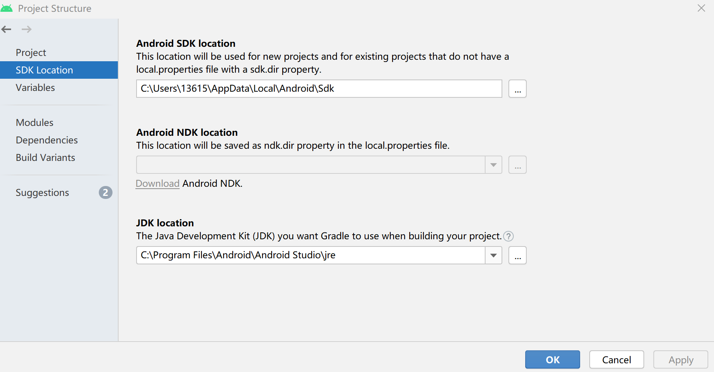
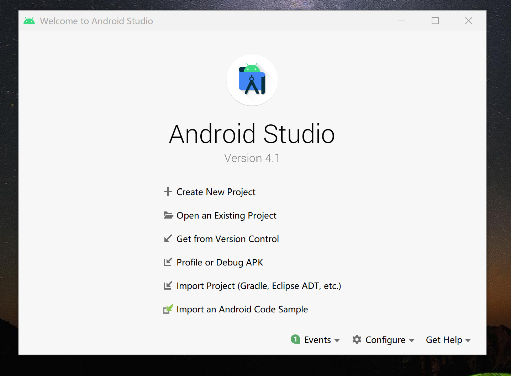
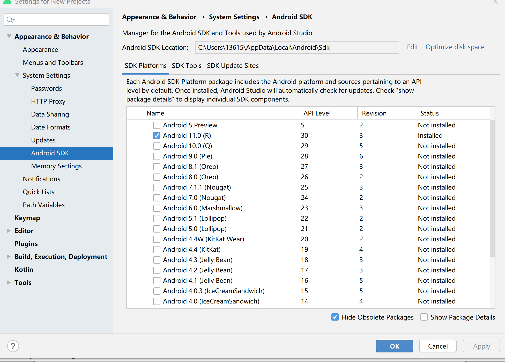
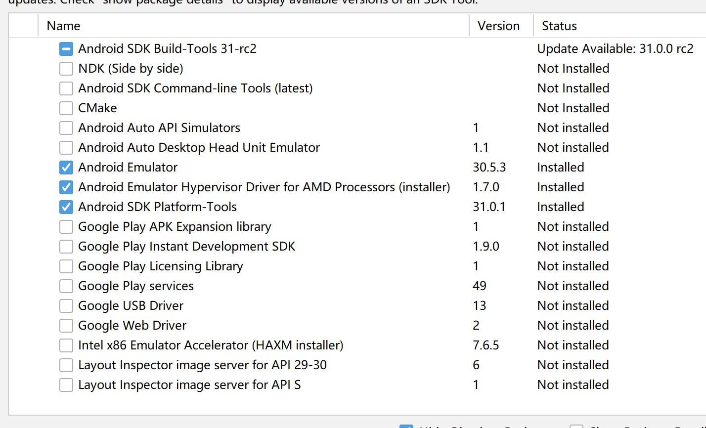
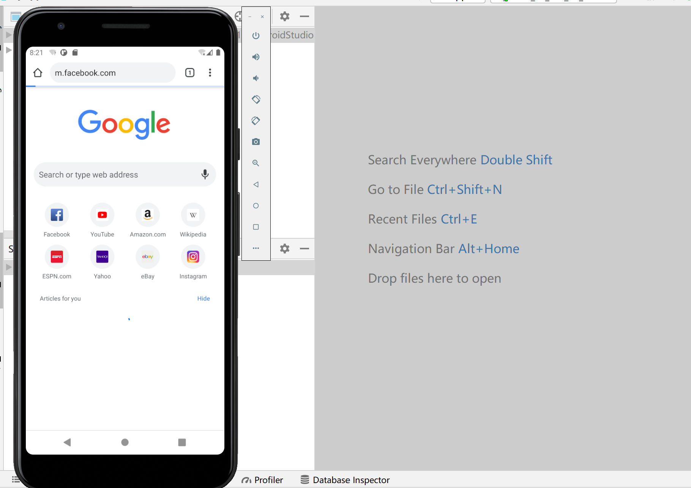
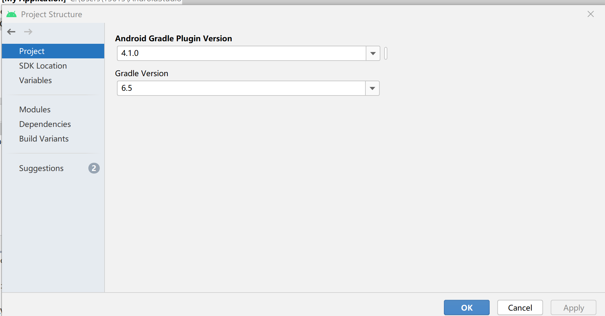
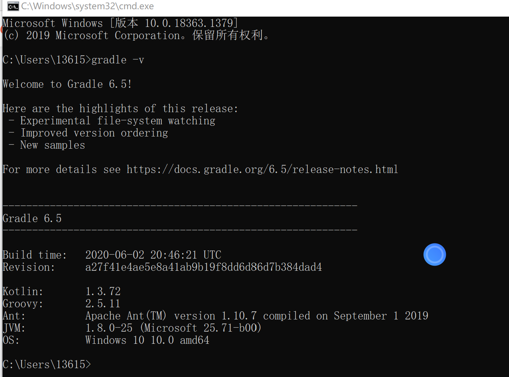

## Android Studio模拟器实验环境搭建  

### 实验要求  
- [x]  安装和配置 Java SDK
- [x] 安装Android Studio  
- [x] 下载安装 Android SDK
- [x] 配置 Android 模拟器运行环境  
- [x] 配置 Gradle 编译环境  

### 实验环境  
* 处理器：AMD Ryzen 7 4800U  
* Windows规格：Windows10 家庭中文版 1909  
* Android Studio 4.1  

### 实验步骤  
#### 安装和配置 Java SDK  
>Android Studio 安装后已经内置了 Java 运行时环境，以 Android 3.2.1 为例，通过菜单 File -> Project Structure -> SDK Location 可以查看到 Android Studio 在编译当前项目时使用的 JDK 目录。  

Android Studio 4.1也是同样的查看方法
   

#### 安装Android Studio   
>通过官方网站下载最新版本并根据提示安装,成功安装后界面如图  

  

#### 下载安装 Android SDK  
>在默认打开项目的视图工具菜单里找到 SDK Manager 按钮启动 SDK Manager  

  

#### 配置 Android 模拟器运行环境  
* 因为处理器是AMD，安装 Intel x86 Emulator Accelerator (HAXM installer)时失败，勾选Android Emulator Hypervisor Driver for AMD Processors(installer) 进行安装 

  

* 启动AVD Manager,运行  

  

#### 配置 Gradle 编译环境(使用内置gradle)  
* Android Studio 的内置 Gradle版本6.5以及插件版本4.1.0   

  
* 找到解压后的gradle所在位置，以此为变量值，添加系统变量GRADLE_HOME  
* 在环境变量中添加```%GRADLE_HOME%\bin```  

在命令行中使用``` gradle -v```查看版本信息时报错```  JAVA_HOME is not set and no 'java' command could be found in your PATH.```  
  
* Android Studio已经有内置的JDK，找到JDK所在位置，以此为变量值，添加系统变量JAVA_HOME  

  

**参考资料**  
[第五章实验指导](https://github.com/c4pr1c3/cuc-mis/blob/master/chap0x05/exp.md)  
[JAVA_HOME is not set and no ‘java‘ command could be found in your PATH](https://blog.csdn.net/GodnessIsMyMine/article/details/107352651)  
[Gradle安装及环境变量配置](https://blog.csdn.net/zbx931197485/article/details/102461228)

