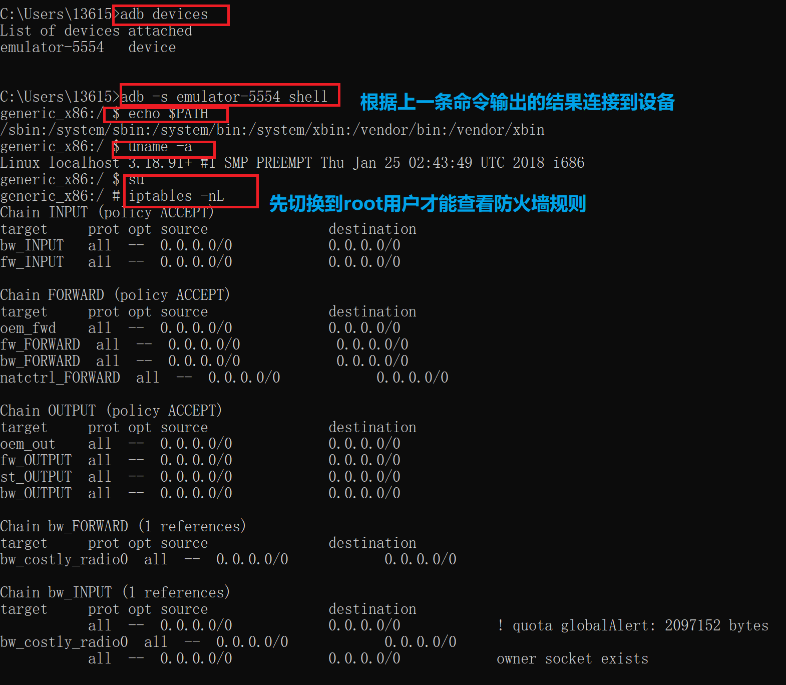
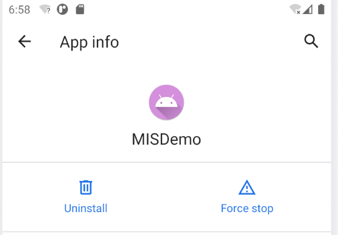

## 安卓系统访问控制策略与机制  
### 实验环境  
* Andriod Studio 4.1  
* Pixel XL API 27
### 实验过程  
#### ADB实验
* **基本命令**  
```  
# 基本命令
#  cd / ls / pwd / ps / grep /kill / cat / chmod /chown / mkdir /echo /
# touch / du / df / set / uptime / top / ifconfig / more

# 进阶命令
# su / iptables / iftop / lsof / mount / vmstat / wpa_cli / sqlite3  
```
```  
# 查看开启的模拟器
adb devices

# 连接模拟器终端
adb -s emulator-5554 shell

# 输出环境变量
echo $PATH

# Android5.1(API22): not found
uname -a

# 查看防火墙规则
iptables -nL  
```
   

```  
# 将文件复制到设备/从设备复制文件
adb pull remote local
adb push local remote   
# 安装应用
adb install path_to_apk    
```  

* **AVD Manager 命令实例**
```
# Camera（照相机）的启动方法为:
am start -n com.android.camera/com.android.camera.Camera
```  
报错，貌似不支持,详细报错信息：
```
Starting: Intent { cmp=com.android.camera/.Camera }
Error type 3
Error: Activity class {com.android.camera/com.android.camera.Camera} does not exist.  
```

``` 
# Browser（浏览器）的启动方法为：
am start -n com.android.browser/com.android.browser.BrowserActivity
```
同样报错，详细信息如下：
```  
Starting: Intent { cmp=com.android.browser/.BrowserActivity }
Error type 3
Error: Activity class {com.android.browser/com.android.browser.BrowserActivity} does not exist.  
```  

```
# 启动浏览器 :
am start -a android.intent.action.VIEW -d  http://sec.cuc.edu.cn/  
# 拨打电话 :
am start -a android.intent.action.CALL -d tel:10086
# 发短信：
adb shell am start -a android.intent.action.SENDTO -d sms:10086 --es sms_body ye --ez exit_on_sent true    
```  


<figure class="third">
    
</figure>  
  
  

* **Package Manager 命令**
```  
# 在 adb shell 中，可以使用软件包管理器 (pm) 工具发出命令，以对设备上安装的应用软件包进行操作和查询。
 pm command
 # 也可以直接从 adb 发出软件包管理器命令，无需进入远程 shell
 adb shell pm uninstall com.example.MyApp
 ```  

 * **其他ADB命令**
 ```  
 # 常用的按键对应的KEY_CODE
adb shell input keyevent 22 //焦点去到发送键  
adb shell input keyevent 66 //回车按下
adb shell input keyevent 4 // 物理返回键
adb shell input keyevent 3 // 物理HOME键  
# android 4.0+
$ input
usage: input ...
       input text <string>
       input keyevent <key code number or name>
       input tap <x> <y>
       input swipe <x1> <y1> <x2> <y2>  
```  


<figure class="third">
      
</figure>  


### hello world v1
* **按照[教程](https://developer.android.google.cn/training/basics/firstapp/running-app)构建第一个应用**
老师的视频和官方文档都讲的十分详细啦，在这里就不一一赘述
最后的结果是：  


<figure class="half">
    
</figure>  

* **回答问题**
    - [x] 按照向导创建的工程在模拟器里运行成功的前提下，生成的APK文件在哪儿保存的？  
        >..\AndroidStudioProjects\MISDemo\app\build\outputs\apk

    - [x] 使用adb shell是否可以绕过MainActivity页面直接“唤起”第二个DisplayMessageActivity页面？是否可以在直接唤起的这个DisplayMessageActivity页面上显示自定义的一段文字，比如：你好移动互联网安全  
        >adb -s emulator-5554 shell am start -n cuc.edu.cn/cuc.edu.cn.DisplayMessageActivity --es "cuc.edu.cn.MESSAGE" "hello"
        
    - [x] 如何实现在真机上运行你开发的这个Hello World程序？
        >参照[官网](https://developer.android.google.cn/training/basics/firstapp/running-app)给出的方法
        1.使用一根 USB 线将设备连接到开发机器。如果您是在 Windows 上开发的，则可能需要为设备安装合适的 USB 驱动程序。
2.执行以下步骤，在开发者选项窗口中启用 USB 调试：
a.打开设置应用。
b.如果您的设备使用 Android v8.0 或更高版本，请选择系统。否则，请继续执行下一步。
c.滚动到底部，然后选择关于手机。
d.滚动到底部，然后点按版本号七次。
e.返回上一屏幕，滚动到底部，然后点按开发者选项。
f.在开发者选项窗口中，向下滚动以查找并启用 USB 调试。
g.按照以下步骤操作，在设备上运行应用：
(1)在 Android Studio 中，从工具栏中的运行/调试配置下拉菜单中选择您的应用。
(2)在工具栏中，从目标设备下拉菜单中选择要用来运行应用的设备。  

    - [x] 如何修改代码实现通过 ```adb shell am start -a android.intent.action.VIEW -d http://sec.cuc.edu.cn/ ```可以让我们的cuc.edu.cn.misdemo程序出现在“用于打开浏览器的应用程序选择列表”？
        >打开 AndroidManifest.xml，添加代码
        ```
        <action android:name="android.intent.action.VIEW" />
        <category android:name="android.intent.category.DEFAULT" />
        <category android:name="android.intent.category.BROWSABLE" />
        <data android:scheme="http" />
        <data android:scheme="https" />
        ```
    - [x] 如何修改应用程序默认图标？
        >Project > app > res > mipmap > 新建 Image Assert  
        这里简单修改图标背景为紫色(原来是浅绿色)  
        

    - [x] 如何修改代码使得应用程序图标在手机主屏幕上实现隐藏？
        >在MainActivity.java，添加代码
        ```
        PackageManager packageManager = getPackageManager();
        ComponentName componentName = new ComponentName(MainActivity.this, MainActivity.class);
        packageManager.setComponentEnabledSetting(componentName,
        PackageManager.COMPONENT_ENABLED_STATE_DISABLED, PackageManager.DONT_KILL_APP);
        ```
### 问题与解决
* 无法直接在命令行使用ADB命令
    >将adb.exe的路径添加到环境变量中，我的是C:\Microsoft\AndroidSDK\25\platform-tools
* MainActivity.java中``` EditText editText = (EditText) findViewById(R.id.editTextTextPersonName)```报错
    >这段代码是通过id寻找编辑文本框，所以不能够简单的从教程复制，要看自己的布局文件（activity_main.xml)里面编辑文本框的id是什么。  
### 参考资料
[第六章实验指导](https://github.com/c4pr1c3/cuc-mis/blob/master/chap0x06/exp.md)  
[Android Studio官方教程](https://developer.android.google.cn/training/basics/firstapp/running-app)
