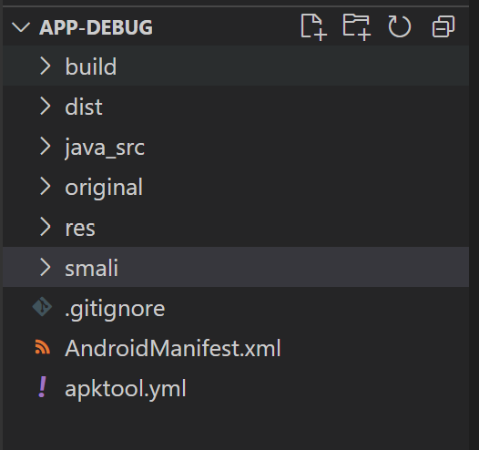
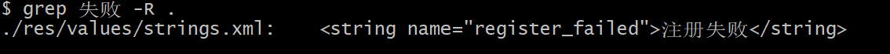
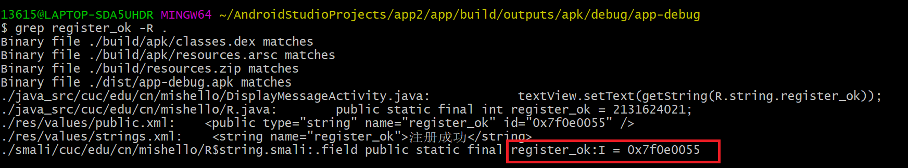
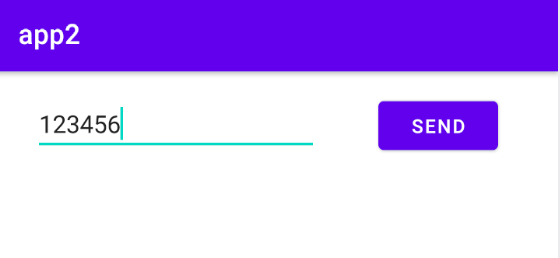
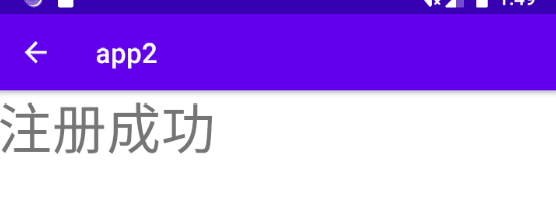
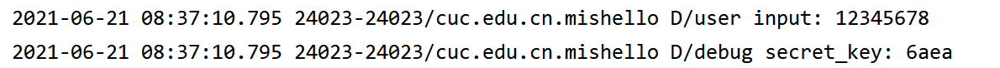
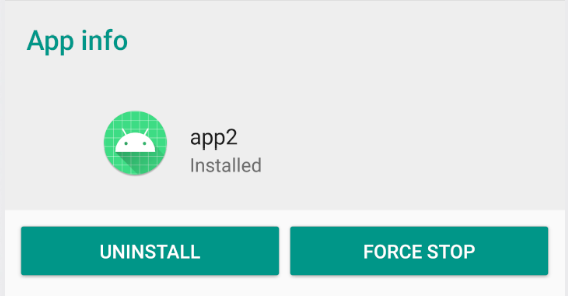

## 软件系列逆向实验  
### 实验要求  
- [x] 使用apktool反汇编上一章实验中我们开发的Hello World v2版程序，对比Java源代码和smali汇编代码之间的一一对应关系。
- [x] 对Hello World v2版程序生成的APK文件进行程序图标替换，并进行重打包，要求可以安装到一台未安装过Hello World v2版程序的Android模拟器中。
- [x] 尝试安装重打包版Hello World v2到一台已经安装过原版Hello World v2程序的模拟器中，观察出错信息并解释原因。
- [x] 去掉Hello World v2版程序中DisplayMessageActivity.java代码中的那2行日志打印语句后编译出一个新的apk文件，假设文件名是：misdemo-v3.apk，尝试使用课件中介绍的几种软件逆向分析方法来破解我们的认证算法。  
### 实验环境  
* VS Code APKLab  
* Pixel XL API 27(Android 8.1)  
### 实验过程  
#### smali代码分析  
* 打开APK file，进行反汇编  
    
    ```  
    VS Code-->View-->Command Palette-->APKLab:Open an APK  
    #此时APKLab会联网下载相关扩展，失败的话需要自己手动下载，并在扩展设置里配置路径  
    ```  
  成功反汇编后的smali代码位于```../APP-DEBUG/smali/```  

  
 
* 根据DVAHW在模拟器中运行的结果，得知注册码错误时会提示“注册失败”，在反汇编输出目录下进行关键字查找，可以在```res/values/strings.xml```中找到该关键字的注册变量名为register_failed。  

    ```  
    grep '失败' -R . 
    ./res/values/strings.xml:    <string name="register_failed">注册失败</string>  
    ```  
    
* 用文本编辑器打开 res/values/strings.xml 查看会在上述代码行下一行发现：
    ```
    <string name="register_ok">注册成功</string>  
    ```
* 继续在反汇编输出目录下进行关键字查找：register_ok，可以发现
    ```
    ./smali/cn/edu/cuc/misdemo/R$string.smali:.field public static final register_ok:I = 0x7f0e0055  
    ```  
    
* 现在，我们有了register_ok的资源唯一标识符：0x7f0e0055，使用该唯一标识符进行关键字查找，我们可以定位到这一段代码：
    ```
    ./smali/cn/edu/cuc/misdemo/DisplayMessageActivity.smali:    const v4, 0x7f0e0055  
    ```  
* **破解简单注册小程序（信息反馈法）**  
从[smali代码的注释说明中](https://github.com/c4pr1c3/cuc-mis/blob/master/chap0x07/exp.md)我们了解到输入正确的验证码注册才能成功，并且根据这个逻辑，定位到了代码的这一块（比较部分）  
  
简单取反，只要不输入正确的注册码，都能注册成功  
    ```  
    if-nez v4, :cond_0  
    ```    
    * 重打包  
        ```  
        apktool.yml-->rebulid the apk  
        ```  
        重新生成的APK在```../dist/```目录下，将其安装到模拟器  
        ```  
        adb install app-debug.apk  
        ```  
    * 查看破解效果  
    输入任意字符  
      
    注册成功  
        
* **破解简单小程序（插桩法）**  
    * 打开Android Studio中的logcat，切换成Debug模式，在模拟器上运行DVAHW，加入打印日志语句  
        ```  
        Log.d("user input", message);
        Log.d("debug secret_key", secret_key);  
        ```  
    * 运行app，输入任意注册码，查看日志  
    
    * 成功获取正确的注册码  
#### 替换程序图标  
将应用程序图标文件```..\res\mipmap-xxxhdpi\ic_launcher.png```替换成自己想要更改的图标文件  
#### 安装重打包应用到已安装该应用的模拟器，观察报错信息并解释原因  
教学视频中已经解释过```这是由于两个安装包的版本号是一样的，而签名不一致```  
解决方法：  
>卸载之前的程序，重新安装  
 
### 问题与解决  
* APKLab使用JAVA反汇编失败，报错```spawn JAVA ENOENT```  
    >将JAVA路径添加到系统环境变量里  
* 安装程序到未安装过该程序的模拟器中，报错```INSTALL_FAILED_TEST_ONLY]```   
    >将android:testOnly=""参数值改为false  
### 参考资料  
[移动互联网安全教学视频](https://www.bilibili.com/video/BV1rr4y1A7nz?from=search&seid=15931812050915535394)   
[移动互联网安全课本](https://github.com/c4pr1c3/cuc-mis/blob/master/chap0x07/exp.md)