## 重新编译Android 缺陷应用漏洞攻击实验  
### 实验目的  
* 理解 Android 经典的组件安全和数据安全相关代码缺陷原理和漏洞利用方法；
* 掌握 Android 模拟器运行环境搭建和 ADB 使用；  
### 实验环境  
* Android Studio 4.2.1  
* python 2.7  
* Android-InsecureBankv2  
* APKLab    
### 实验要求  
- [x] 详细记录实验环境搭建过程；
- [x] 至少完成以下实验：
    - [x] Developer Backdoor
    - [x] Insecure Logging
    - [x] Android Application patching + Weak Auth
    - [x] Exploiting Android Broadcast Receivers
    - [x] Exploiting Android Content Provider  
    - [x] (可选)Bypass Android Root detection 
    - [x] (可选)Exploiting Weak Cryptography  
- [ ] (可选）使用不同于Walkthroughs中提供的工具或方法达到相同的漏洞利用攻击效果；
推荐 drozer  
### 实验过程  
#### 详细记录实验环境搭建过程  
* **克隆Android-InsecureBankv2仓库到本地**  
    ```git clone https://github.com/c4pr1c3/Android-InsecureBankv2.git```  
* **在 kali Linux中搭建服务端**  
    ```
    进入..\Android-InsecureBankv2\AndroLabServer目录  
    pip install install -r requirements.txt --two
      
    # 运行HTTP server
    python app.py  
    ```  
    搭建完成  
    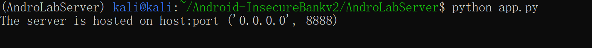  
* **安装客户端**  
    开启AVD镜像，然后命令行中输入以下命令  
    ```adb install  InsecureBankv2.apk```    
    客户端安装完毕  
    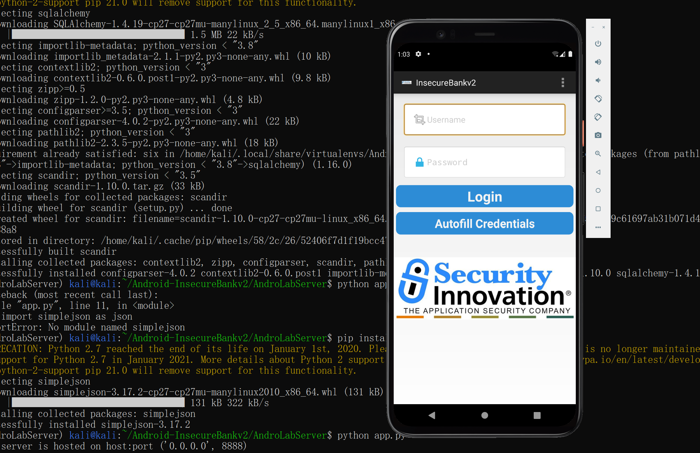  
    第一次登陆需要设置服务器  
    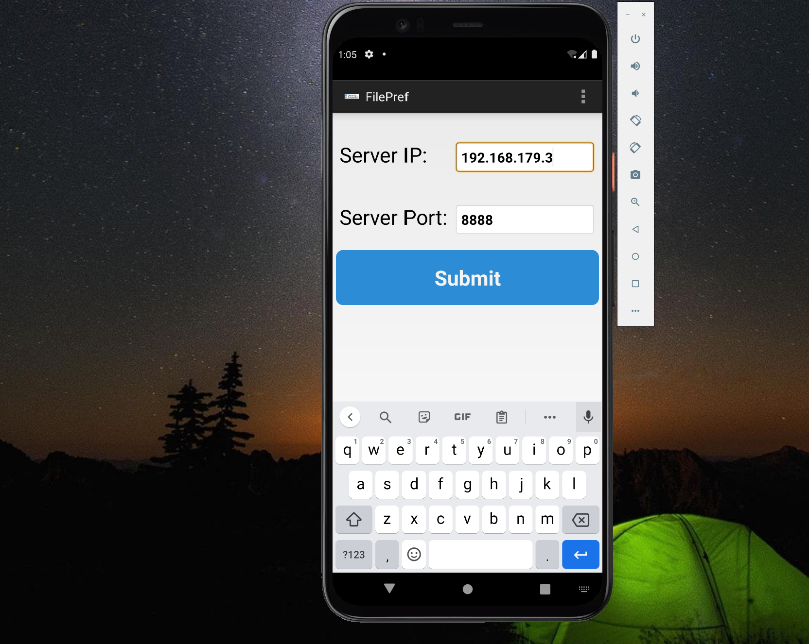
    使用合法用户（jack/Jack@123$)登录  
    </img> 
* **下载jadx工具**  
```  
  git clone https://github.com/skylot/jadx.git
  cd jadx
  gradlew dist  
```  
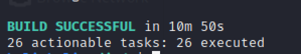  
* **下载dex2jar工具**  
```  
https://sourceforge.net/projects/dex2jar/files/dex2jar-2.0.zip/download  
#下载完成后解压缩即可  
```  
#### Developer Backdoor  
* 安装Insecurev2.apk到模拟器    
* 解压apk文件，得到classes.dex  
```  
unzip InsecureBankv2.apk  
```  
* 赋予shell脚本可执行权限  
```  
chmod +x d2j-dex2jar.sh
chmod +x d2j_invoke.sh  
```  
* 将dex文件转化成jar文件  
```  
sh d2j-dex2jar.sh classes.dex  
```  
* 使用jadx-gui工具打开上述得到的jar文件  
```   
./jadx-gui <path to classes-dex2jar.jar>
```  
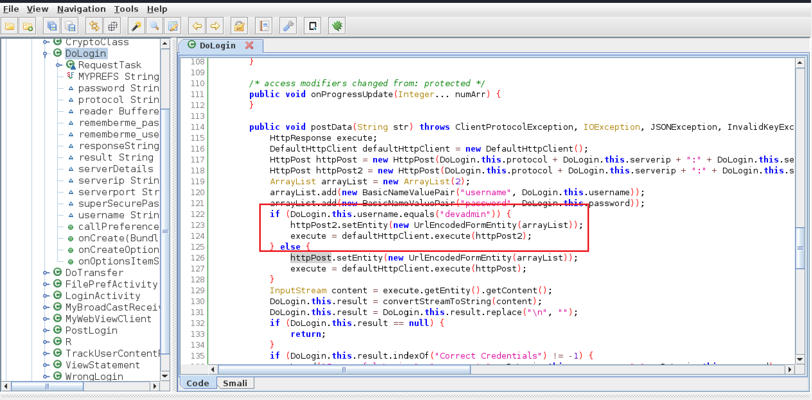   
发现devadmin用户不需任何密码就可以登录APP
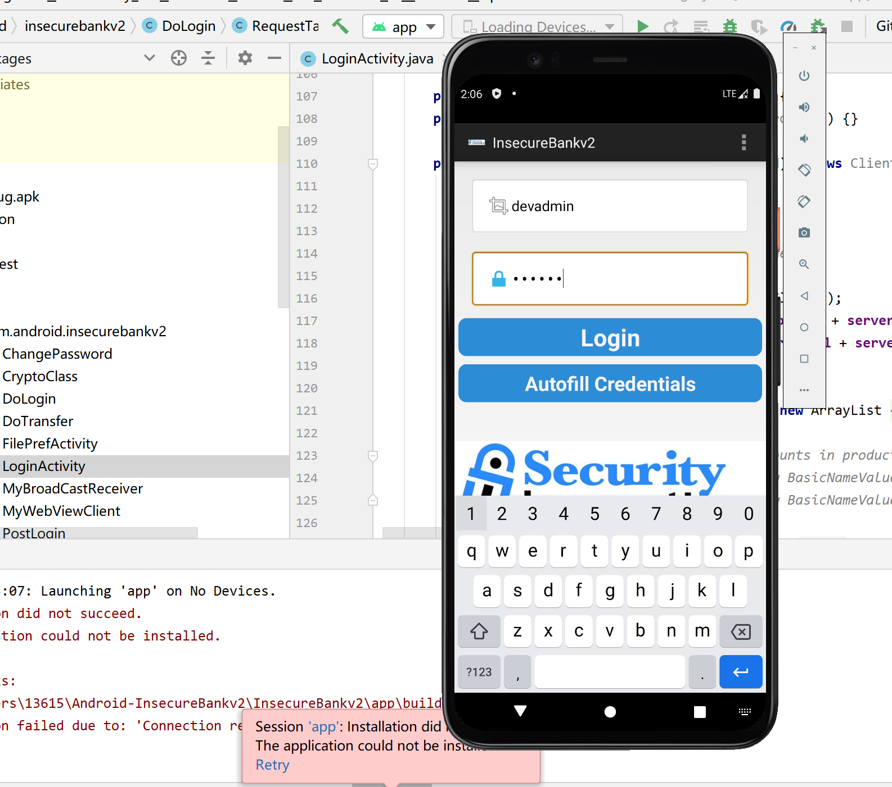  
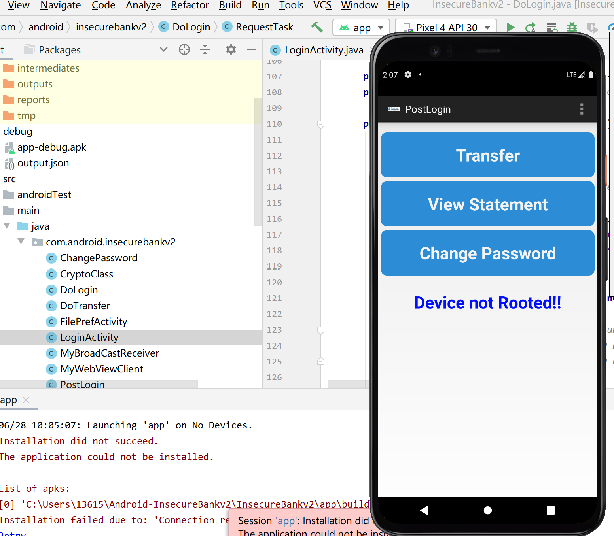    
#### Insecure Logging  
* 安装Insecurev2.apk到模拟器  
* 使用logcat查看日志  
* 使用合法用户登录APP，修改密码  
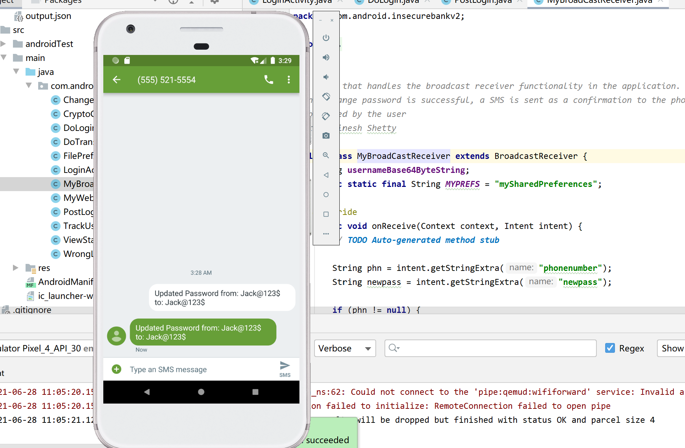  
* 可以在日志中查看用户登录密码和修改后的密码  

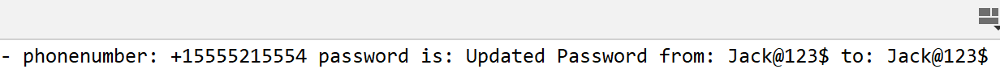
#### Android Application patching + Weak Auth  
* 安装Insecurev2.apk到模拟器  
* 使用APKLab对apk文件进行反汇编  
* 在string.xml中将is_admin的值从no修改成yes  
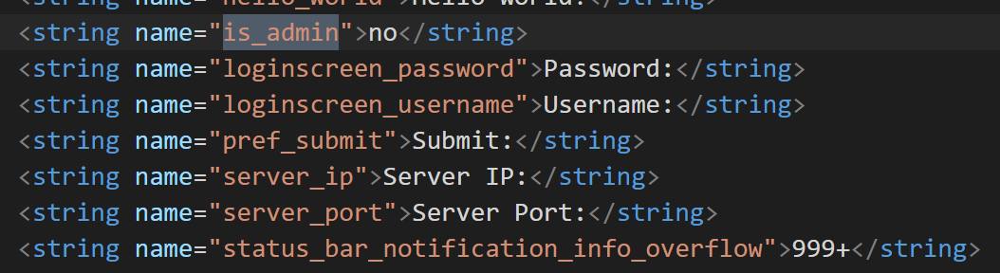  
* 同第七章实验一样进行重打包和重签名，将生成的apk文件安装到模拟器上  
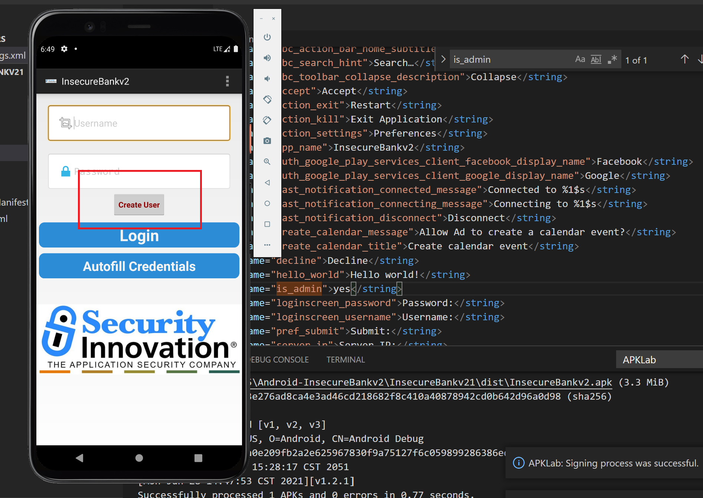  
出现create user按钮   
#### Exploiting Android Broadcast Receivers  
* 安装Insecurev2.apk到模拟器  
* 使用APKLab对apk文件进行反汇编  
* 在```AndroidManifest.xml```文件中找到了  
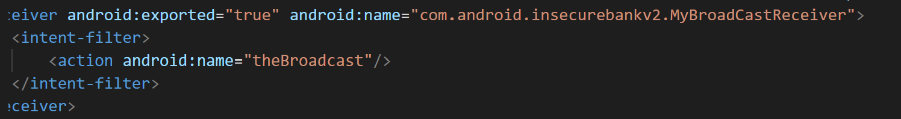   
* 使用jadx-gui打开之前生成的classes-dex2jar.jar，找到了   
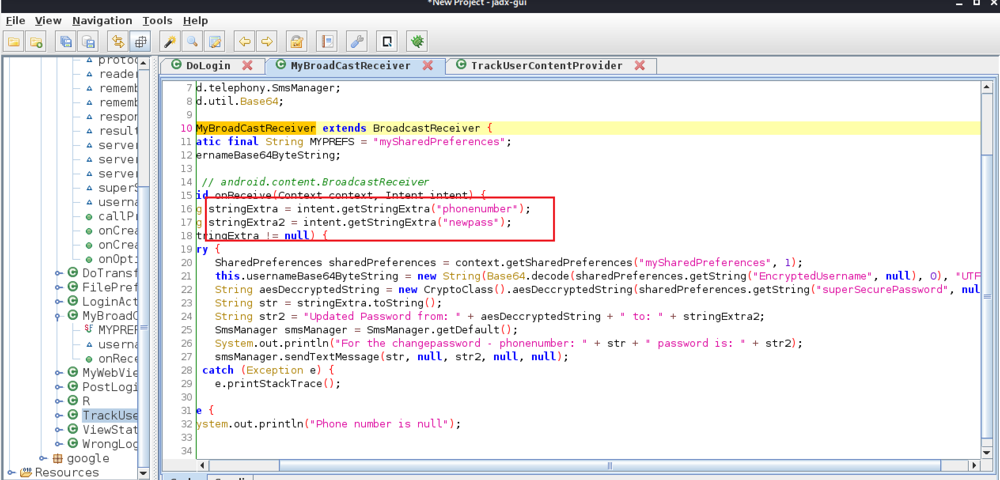  
* 打开模拟器，并在命令行中输入：  
```  
abd shell am broadcast -a theBroadcast -n com.android.insecurebankv2/com.android.insecurebankv2.MyBroadCastReceiver --es phonenumber 5554 --es newpass Dinesh@123!  
```
可以绕过登录界面修改用户密码，收到了密码已被修改的短信  

#### Exploiting Android Content Provider  
* 安装Insecurev2.apk到模拟器  
* 使用APKLab对apk文件进行反汇编  
* 在```AndroidManifest.xml```文件中找到了  
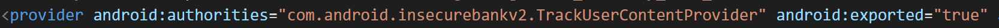  
* 使用jadx-gui打开之前生成的classes-dex2jar.jar，找到了  
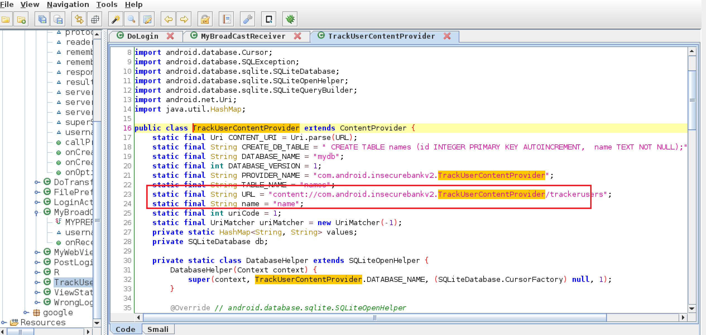  
可以发现登录的用户名会被保存在数据库中  
* 使用dinesh、jack等用户账号登录后，在命令行中输入：  
```  
adb shell content query --uri content://com.android.insecurebankv2.TrackUserContentProvider/trackerusers  
```  
可以看到用户的登录数据  
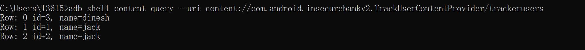  
#### (可选)Bypass Android Root detection  
>因为照着教程做完之后发现教程的目的是任何用户登入都显示不是root用户，想做一个普通用户登入显示是root用户的实验，所以相比教程有小改动  
* 先看一下普通用户登录APP  
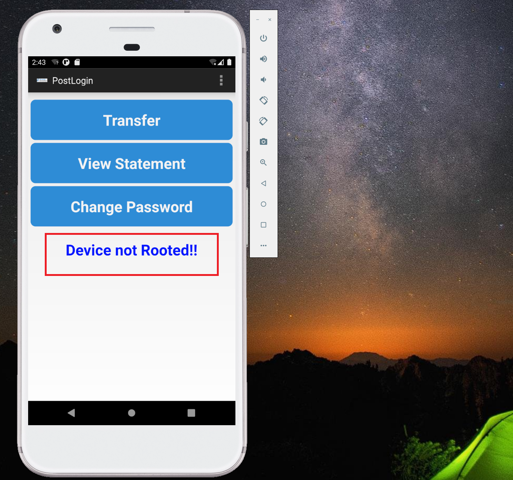  
* 使用jadx-gui打开之前生成的classes-dex2jar.jar，关于root用户，找到了   
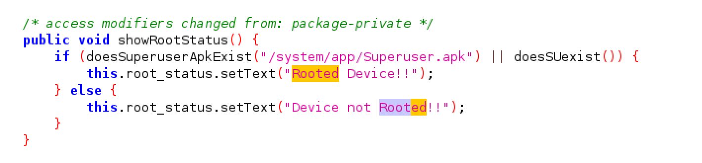  
* 使用APKLab进行反汇编，找到登录时判断用户状态的代码  
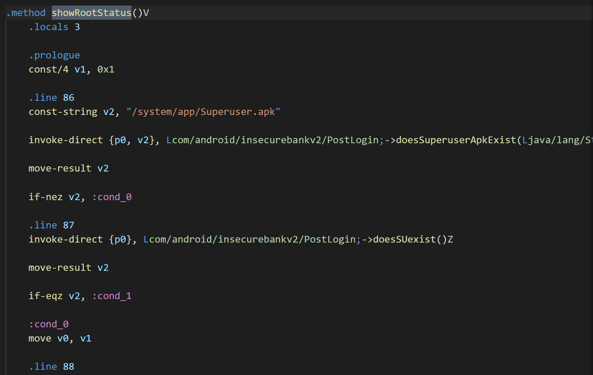  
代码中，先进行一个条件判断（用户是否是superUser)，满足条件执行```Rooted Device```，否则跳转执行```Device not Rooted```
原教程思路是：
```  
注释掉条件判断  
执行无条件跳转到Device not Rooted  
即可绕过权限判断  
```  
改动后，我们对条件简单取反，达到普通用户可以作为root用户登入app的效果  
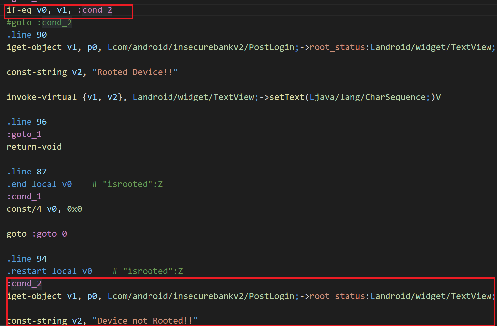  
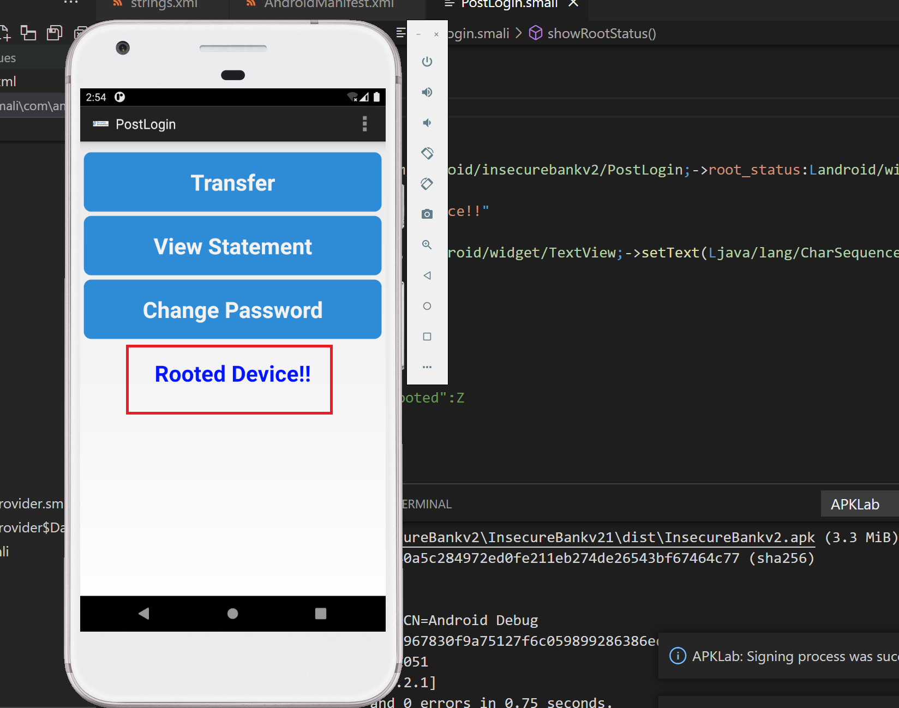
#### (可选)Exploiting Weak Cryptography 
* 安装Insecurev2.apk到模拟器  
* 打开模拟器，并在命令行中输入： 
```  
cd /data/data/com.android.insecurebankv2/shared_prefs/  
```  
* 查看```superSecurePassword```字段的值  
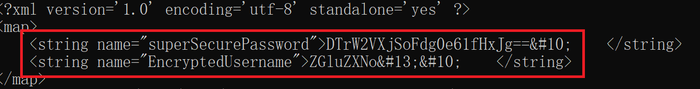
* 使用jadx-gui打开之前生成的classes-dex2jar.jar，找到了   
  
* 根据上述得到的数据，在cypherchef进行解密  
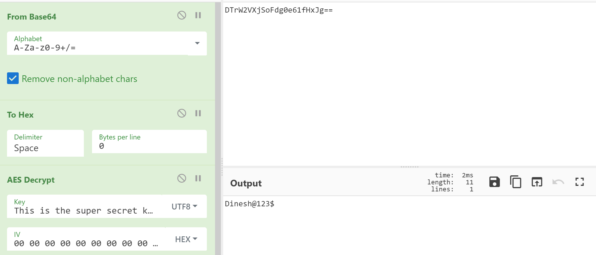  
即可获取用户登陆密码 
### 问题与解决  
* 搭建服务器过程中，运行```app.py```文件提示缺少模块  
    >根据报错信息使用pip安装所需模块  
* 实验时突然发现所有用户都无法登入APP，提示“无效用户”  
    >玄学问题，重启解决  
### 参考资料  
[Android-InsecureBankv2](https://github.com/c4pr1c3/Android-InsecureBankv2/tree/master/AndroLabServer)  


